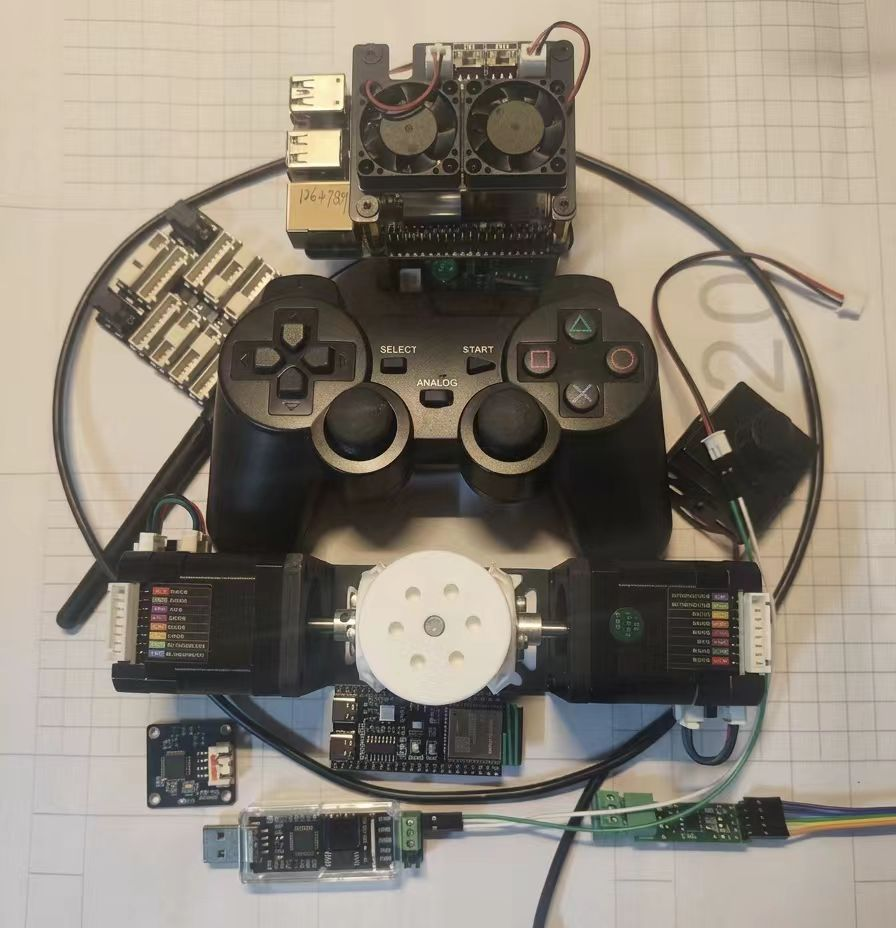
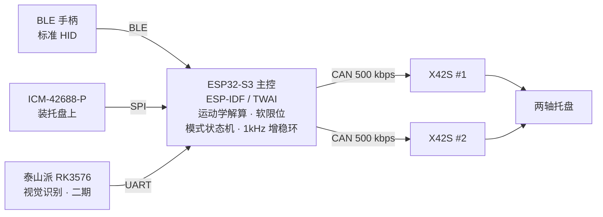
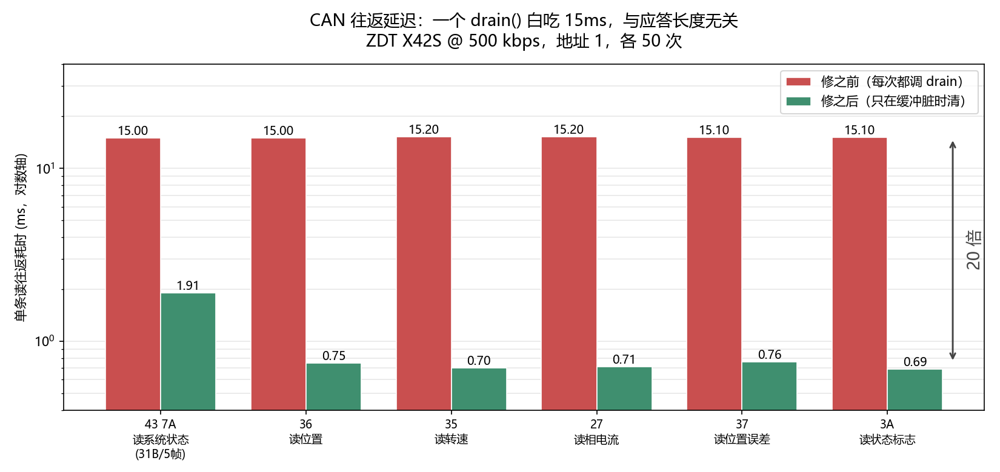
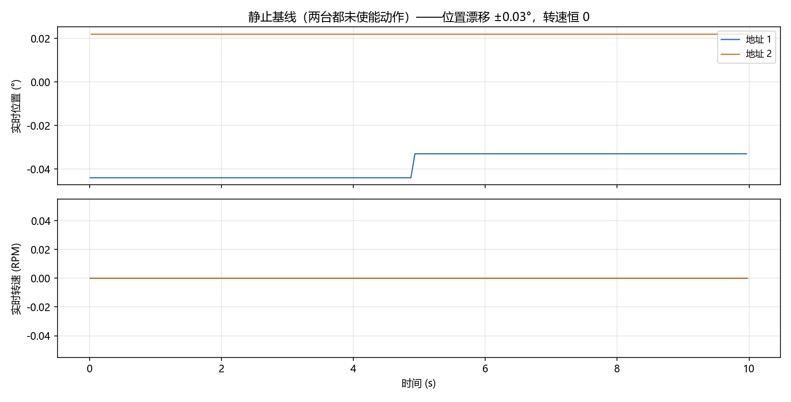

<div align="center">

# 二轴惯性 / 视觉复合稳定跟踪转台

**2-DOF Inertial / Vision Compound-Stabilized Tracking Turret**

两轴斜锥齿轮差速传动 · CAN 总线驱动 · BLE 手柄操控 · 惯性增稳 · 视觉自动跟踪




<sub>当前硬件：2× ZDT X42S 闭环步进 + 斜锥齿轮差速机构 · ESP32-S3 主控 ·
BLE 手柄 · USB-CAN 适配器</sub>

</div>

---

## 项目简介

一个两轴稳定跟踪转台：载荷托盘要同时做到**俯仰**和**自转**两个自由度，
靠一对斜锥齿轮把两台电机的运动**差速合成**出来。

- **俯仰/俯视** → 两台电机世界同向同角度：`(θ₁ + θ₂) / 2`
- **自转/spin** → 两台电机世界反向同角度：`(θ₁ − θ₂) / 2`

在这个机构上做三层控制：

| 层 | 带宽 | 作用 |
|---|---|---|
| 电机内环 | 20 kHz | X42S 闭环步进自己的电流/位置环 |
| **增稳环** | 1 kHz | IMU 陀螺反馈，主动抑制扰动 |
| 指向环 | 30 FPS | 手柄 / 视觉给出的目标指向 |

### 为什么做这个

给 2027 秋招用的个人技术项目，重点不只是"把东西做出来"，
更是**每个决策的取舍理由**——所以 [`docs/00-总体方案-PRD.md`](docs/00-总体方案-PRD.md)
第 6 章专门写了 9 个关键决策的备选方案对比。

---

## 系统架构



**控制分层**（带宽差三个数量级，所以必须分层）：

```
电机内环 20 kHz  ≫  增稳环 1 kHz  ≫  指向环 30 FPS
```

**CAN 总线负载**是选型的关键约束：位置模式 `FD` 在 1 kHz 下会把 500 kbps 总线跑到 **120%**（不可行），
改用速度模式 `F6` 后每周期 2 帧、只占 **26%**。详见
[PRD 2.2 节](docs/00-总体方案-PRD.md) 与 [决策 6.8](docs/00-总体方案-PRD.md)。

---

## 关键设计决策

| # | 问题 | 选择 | 核心理由 |
|---|---|---|---|
| 1 | 主控选型 | **ESP32-S3**（非 STM32H743） | `twai` + `esp_hid_host` 都是官方组件，BLE 手柄直连不用外挂模块 |
| 2 | 电机接口 | **CAN**（非 UART TTL） | 一条总线挂多机 + 原生多机同步广播，抗干扰强 |
| 3 | 固件框架 | **ESP-IDF**（非 Arduino/MicroPython） | 需要 1 kHz 硬实时环和原生 BLE HID 主机 |
| 4 | 跟踪律位置 | **ESP32 侧**（非泰山派） | 运动学/限位/安全必须在实时侧，视觉只上报像素偏差 |
| 5 | 视觉链路 | **UART**（非 WiFi/USB） | 低延迟确定性强，UDP 抖动会吃掉跟踪带宽 |
| 6 | 视觉算法 | **先手工特征，后训练模型** | 让链路与算法解耦验证，不把两个风险叠一起 |
| 7 | IMU 安装位 | **托盘（载荷）上** | 直接测载荷姿态，扰动观测不含机构柔性误差 |
| 8 | 增稳指令 | **速度模式 `F6`**（非位置模式 `FD`） | 位置模式 1 kHz 下总线负载 120%，速度模式仅 26% |
| 9 | 增稳本质 | **提高阻尼**（非提高增益） | 高增益会放大噪声并激励机构共振，阻尼才是稳定手段 |

> 完整对比与数据见 [PRD 第 6 章](docs/00-总体方案-PRD.md)。

---

## 实测数据

都是实机测出来的，不是估算。

### CAN 往返延迟



| 命令 | 应答大小 | 修前 | 修后 |
|---|---|---|---|
| `43 7A` 读系统状态 | 31 B / 5 帧 | 15.0 ms | 1.91 ms |
| `36` 读实时位置 | 7 B / 1 帧 | 15.0 ms | 0.75 ms |
| `35` 读实时转速 | 7 B / 1 帧 | 15.2 ms | 0.70 ms |
| `27` 读相电流 | 7 B / 1 帧 | 15.2 ms | 0.71 ms |
| `37` 读位置误差 | 7 B / 1 帧 | 15.1 ms | 0.76 ms |
| `3A` 读状态标志 | 7 B / 1 帧 | 15.1 ms | 0.69 ms |

**修前这些数字全都一样（~15 ms），跟应答长度无关**——这就是破绽。
真正的根因是每次读之前的缓冲清理调用 `drain()`：它用 `bus.recv(timeout=0)`，
而 python-can 的 gs_usb 后端把 `timeout=0` 当成 `1 ms`，
Windows 上 libusb 的短超时会凑到系统定时器节拍（~15.6 ms），
于是**空缓冲一次也要 15 ms**。

修法是让成功路径不调 `drain()`——`collect(early=True)` 收到完整应答就返回、本来就不留残帧。
完整过程见 [`tools/README.md` §8](tools/README.md)。

> **经验**：怀疑"总线慢/电机慢"时，先用 `latency` 量一下。
> **跟负载无关的常数延迟，先怀疑主机侧，不是外设。**

### 有效采样率

同为两台电机交替轮询：

| 读法 | 修前 | 修后 |
|---|---|---|
| 单条 `36` | 66 Hz | **1 300 Hz**（理论上限） |
| 两台都读全量 `43 7A` | 33 Hz | **130 Hz / 台** |

> 这个结果直接推翻了一个此前的结论："16.6 Hz 是主机问、电机答模式的天花板"。
> 那个天花板根本不存在，是上面这个 bug。**原计划的定时推送方案 `11 18` 因此不必做了。**

### 静止基线



两台未使能动作时的基线：位置漂移 ±0.03°、转速恒 0、相电流 12–16 mA、
`motor_status = 0x03`（使能 + 到位）、总线电压 11.4 V（12 V 供电过反接二极管后）。

---

## 快速开始

### 依赖

```bash
pip install python-can pyusb libusb-package gs_usb matplotlib numpy pyqtgraph PySide6
```

> Windows 上 pip 如果报 `ProxyError ... 10061`，是系统代理干扰：
> `python -m pip install --proxy "" -i https://pypi.tuna.tsinghua.edu.cn/simple <包名>`

### 硬件

| 件 | 规格 | 备注 |
|---|---|---|
| 主控 | ESP32-S3 N16R8 | 16 MB Flash + 8 MB PSRAM |
| 执行机构 | ZDT X42S 闭环步进 ×2 | 3200 脉冲/圈，CAN 接口 |
| IMU | ICM-42688-P | SPI，装托盘上 |
| CAN 收发 | SN65HVD230 / TJA1051 | **唯一需要采购的关键件** |
| 电源 | 12 V | 手册工作范围 10–29 V |

完整清单见 [`hardware/README.md`](hardware/README.md)。

### 跑起来（上位机工具链）

> ⚠️ CAN 适配器同一时间只能被**一个程序**占用。跑之前先关掉官方的
> `Y42_Emm_CAN_Tool` 和 `cangaroo`。

```bash
# 谁在线
python tools/zdt_can.py --addr 1,2 scan

# 读两台状态
python tools/zdt_can.py --addr 1,2 status

# 让云台动起来（俯仰 ±30° 来回 3 次 + 自转 170°）
python tools/gimbal.py --tilt 30 --cycles 3 --spin 170 --rpm 45 --acc 80

# 实时波形（边动边看，窗口里按 X 急停、Q 退出）
python tools/scope.py --motion --tilt 30 --cycles 3 --spin 170 --hz 100

# 采样 10 秒存 CSV，再画出来
python tools/zdt_can.py --addr 1,2 sample --secs 10 --hz 20 --log sample.csv
python tools/plot.py sample.csv
```

或者在 VS Code 里按 F5——`.vscode/launch.json` 里有 26 个预设，编号即使用顺序。

---

## 目录结构

```
.
├── docs/                          # 方案与经验文档
│   ├── 00-总体方案-PRD.md          # 需求规格 + 9 项决策取舍
│   ├── 01-CAN调试入门指南.md       # 从零接通 CAN 的踩坑记录
│   └── assets/                    # README 配图
├── tools/                          # 上位机联调工具（Python）
│   ├── zdt_can.py                 # CAN 命令行工具，20 个子命令
│   ├── gimbal.py                  # 云台动作序列（差速运动学 + 软限位）
│   ├── scope.py                   # pyqtgraph 实时波形示波器
│   ├── plot.py                    # 离线采样画图
│   ├── config.py                  # 标定参数管理
│   └── README.md                  # ← 工具集完整使用说明
├── firmware/                       # ESP32-S3 固件（ESP-IDF）— 进行中
├── hardware/                       # 硬件清单 / 接线 / 机械
│   └── mechanical/                # 斜锥齿轮云台 3D 模型
├── reverse-engineering/            # 逆向官方上位机，还原 CAN 协议
│   ├── notes/                     # 脱壳与反编译记录
│   ├── ghidra_scripts/            # 批量反编译脚本
│   └── reimpl/                    # 用还原协议重写的上位机（可运行）
├── measurements/                   # 实测数据与出图脚本
└── .vscode/launch.json            # 26 个调试预设
```

---

## 开发进度

项目分三期，当前处于**一期**。

| 阶段 | 内容 | 状态 |
|---|---|---|
| **前置** | 逆向官方上位机还原 CAN 协议 | ✅ 完成 |
| **前置** | 上位机联调工具链（6 个 Python 工具） | ✅ 完成 |
| **前置** | 机械结构 3D 建模 | ✅ 完成 |
| **一期** | ESP32-S3 主控 + CAN 驱动双电机 | 🚧 进行中 |
| **一期** | BLE HID 手柄接入（双摇杆速度控制） | ⬜ 未开始 |
| **一期** | ICM-42688 惯性增稳环（1 kHz） | ⬜ 未开始 |
| **二期** | 泰山派视觉识别 → UART 像素偏差上报 | ⬜ 未开始 |
| **二期** | ESP32 视觉跟踪闭环 | ⬜ 未开始 |
| **三期** | 手柄找目标 → 按键切 AUTO 自动跟踪 | ⬜ 未开始 |

> **当前状态说明**：上位机侧（协议逆向 + 工具链 + 机械）已完整可用并经过实机验证；
> ESP32 固件尚未开始，`firmware/` 目前只有架构规划。这个仓库会随开发持续更新。

---

## 文档索引

| 文档 | 内容 |
|---|---|
| [docs/00-总体方案-PRD.md](docs/00-总体方案-PRD.md) | 需求规格、系统架构、通信协议、**9 项关键决策取舍**、里程碑 |
| [docs/01-CAN调试入门指南.md](docs/01-CAN调试入门指南.md) | 从零接通 CAN 的完整流程与根因排查优先级 |
| [tools/README.md](tools/README.md) | 工具集使用说明，含 `drain()` 15 ms 问题的完整过程 |
| [reverse-engineering/notes/](reverse-engineering/notes/) | 加壳程序脱壳、Ghidra 反编译、协议还原证据链 |
| [hardware/README.md](hardware/README.md) | 硬件清单、接线要点、供电方案 |

---

## 许可

[MIT](LICENSE)
